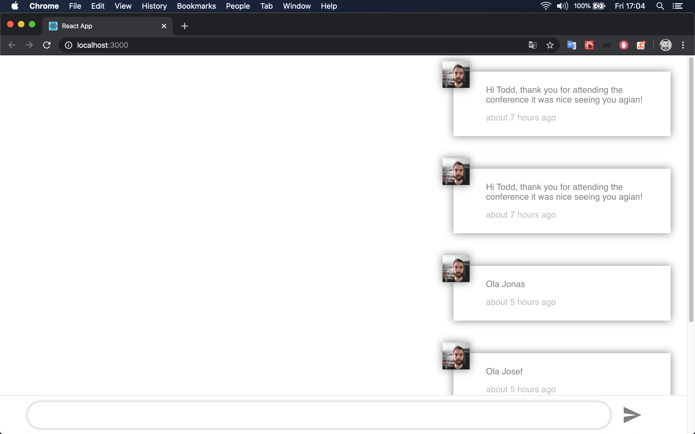

The project ChatWeather is application to study about socket io in nodeJS, ReactJS and React Native.
Will be application that user send messages from chat to other users and if send a solicitation about weather will recieve in real time updates about weather. 

